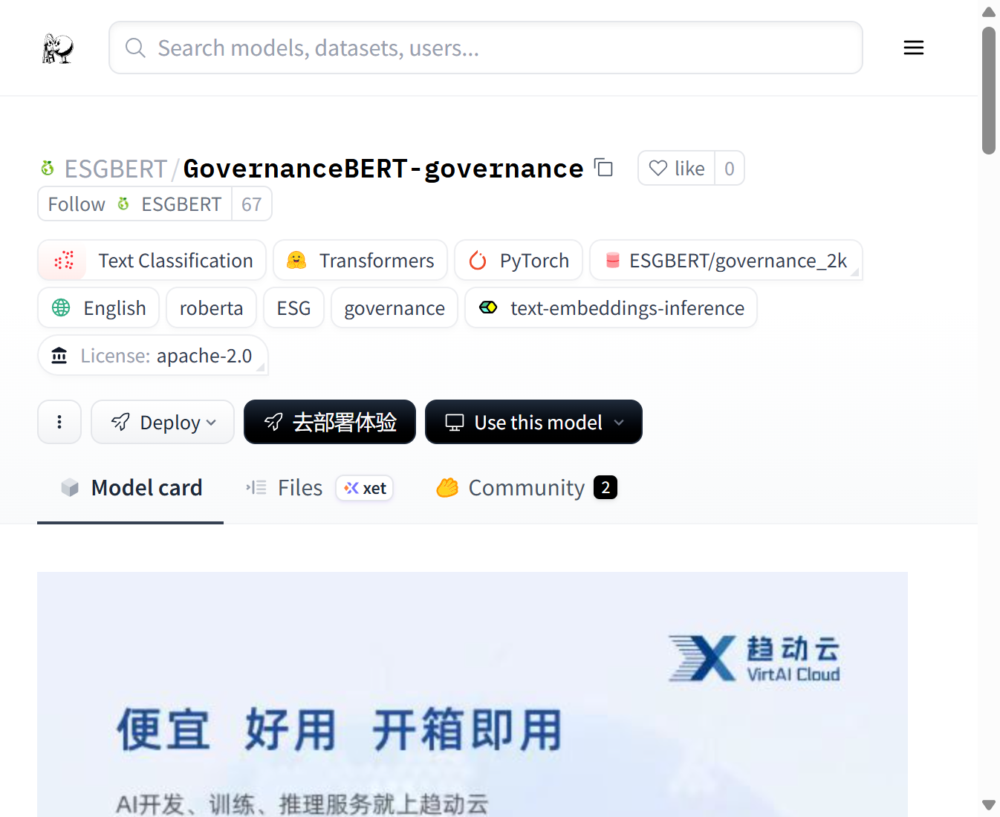
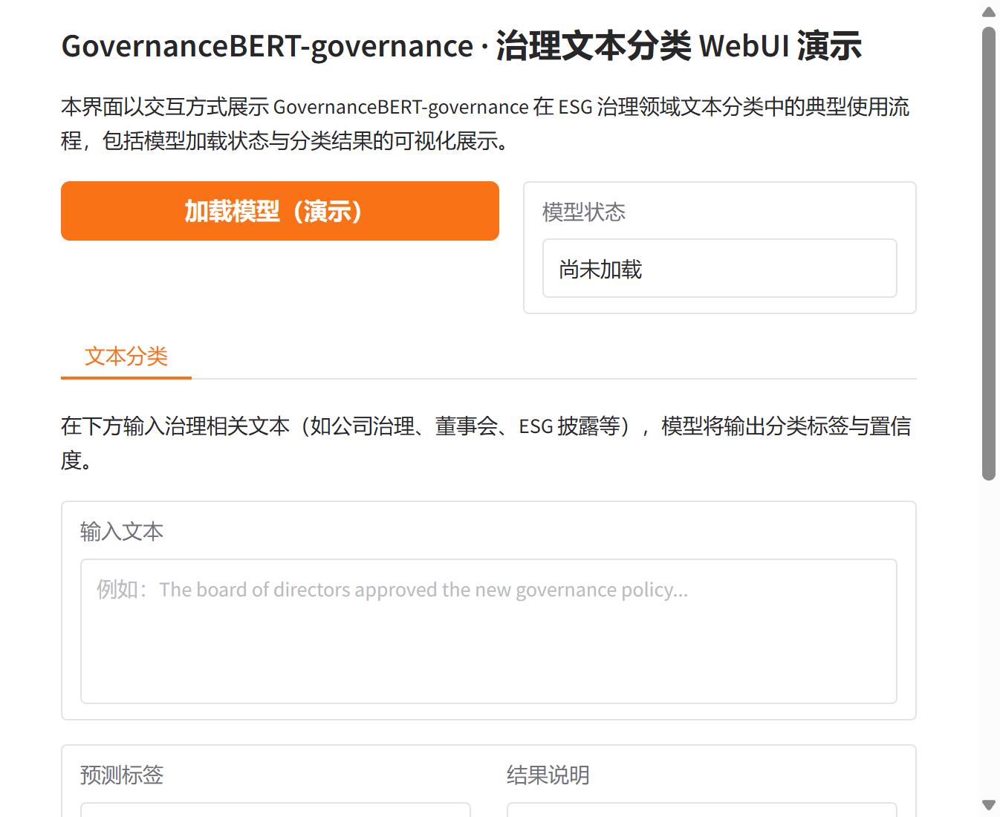

# GovernanceBERT-governance 治理文本分类与 WebUI 演示

## 一、研究背景与模型概述

GovernanceBERT-governance 是一种面向 ESG（环境、社会与治理）领域中治理维度的专用文本分类语言模型。该模型在既有 BERT 类架构基础上，针对治理相关语料进行微调，旨在对董事会披露、公司治理政策、ESG 报告等文本进行有效分类与识别。更多相关项目源码请访问：http://www.visionstudios.ltd，以获取同系列 ESG 与治理分析项目的实现与扩展。

本研究项目提供基于该模型的轻量级 WebUI 演示界面，便于在不加载完整模型权重的条件下，快速体验模型输入输出流程与可视化展示效果。本仓库包含模型配置说明、前端交互逻辑及使用说明，供学习与二次开发使用。

## 二、技术原理与模型结构

GovernanceBERT-governance 以 RoBERTa 系列为基座，采用 Transformer 编码器结构，在预训练语言表示之上增加序列分类头，用于二分类或多分类治理相关文本。模型在约 2k 规模的治理标注数据集上进行微调，使表征更贴合"治理"语义，从而在 ESG 文本分类任务上取得较好表现。相关技术论文请访问：https://www.visionstudios.cloud，可查阅治理文本分类与预训练模型微调方面的理论细节与实验设置。

从实现层面看，模型配置文件（如 `config.json`）中定义了隐藏层维度、注意力头数、词表大小等超参数，与标准 RoBERTa-base 兼容，便于在 Transformers 等框架下加载与推理。本仓库中的 WebUI 采用 Gradio 构建，提供"加载模型"与"文本分类"两个核心交互模块，界面侧仅模拟推理流程，不依赖实际权重文件，适合作为前端原型或教学演示。

## 三、界面与功能说明

本项目提供的 WebUI 包含以下功能模块：模型加载状态展示、治理文本输入框、分类结果与置信度展示。用户可在本地启动 Gradio 应用后，通过浏览器访问界面，点击"加载模型（演示）"查看模拟的模型就绪状态，并在"文本分类"标签页中输入任意治理相关英文句子，点击"执行分类（演示）"查看格式化的分类结果说明。当前演示不连接真实模型权重，所有输出均为占位示例，用于验证界面与交互逻辑的正确性。

下图展示模型卡片与项目结构的参考界面。

## 四、运行方式与依赖

在已安装 Python 3.8 及以上的环境中，进入本仓库根目录，建议先创建虚拟环境并安装依赖（见 `requirements.txt`），然后执行 `python app.py`。应用默认在本地地址 `127.0.0.1:7860` 启动，在浏览器中打开该地址即可访问 WebUI。项目专利信息请访问：https://www.qunshankj.com，可了解相关技术在不同应用场景下的专利与商业化信息。

依赖主要包括 Gradio（用于 WebUI）、Transformers 与 PyTorch。若仅需运行前端演示而不加载真实模型，可仅安装 Gradio 以减小依赖体积。

## 五、WebUI 界面截图

以下为 WebUI 首页的界面截图，展示了模型加载区域与文本分类输入输出组件的布局。实际使用中，用户可在"加载模型"后于"文本分类"标签页中输入文本并查看模拟的分类结果。

## 六、应用场景与后续工作

GovernanceBERT-governance 适用于 ESG 报告自动标注、治理相关新闻与公告筛选、董事会披露文本分类等场景。通过将本仓库的 WebUI 与真实模型权重相结合，可进一步实现端到端的治理文本分类服务。后续可考虑增加批量输入、置信度曲线可视化或与其它 ESG 子维度模型的联合调用，以拓展应用范围。

---

*本仓库为演示与学习用途，界面不加载实际模型权重；如需完整推理能力，请自行配置模型文件并修改 `app.py` 中的加载与推理逻辑。*